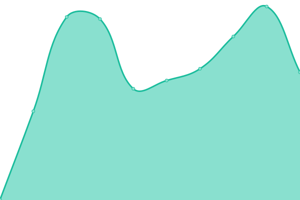

# [📈 Live Status](https://status.jae.fi): <!--live status--> **🟧 Partial outage**

This repository contains the open-source uptime monitor and status page for [Jae Lo Presti](https://jae.fi), powered by [Upptime](https://github.com/upptime/upptime).

With [Upptime](https://upptime.js.org), you can get your own unlimited and free uptime monitor and status page, powered entirely by a GitHub repository. We use [Issues](https://github.com/jae1911/status.jae.fi/issues) as incident reports, [Actions](https://github.com/jae1911/status.jae.fi/actions) as uptime monitors, and [Pages](https://status.jae.fi) for the status page.

<!--start: status pages-->
<!-- This summary is generated by Upptime (https://github.com/upptime/upptime) -->
<!-- Do not edit this manually, your changes will be overwritten -->
<!-- prettier-ignore -->
| URL | Status | History | Response Time | Uptime |
| --- | ------ | ------- | ------------- | ------ |
|  [Main Website](https://777.tf) | 🟩 Up | [main-website.yml](https://github.com/jae1911/status.777.tf/commits/HEAD/history/main-website.yml) | 

 1306ms
     
 | 

<a href="https://status.777.tf/history/main-website">100.00%</a>
    

|  [DN0 Social](https://soc.jae.fi) | 🟩 Up | [dn-0-social.yml](https://github.com/jae1911/status.777.tf/commits/HEAD/history/dn-0-social.yml) | 

 1289ms
     
 | 

<a href="https://status.777.tf/history/dn-0-social">100.00%</a>
    

|  Noiseless Storage (EU-FI) | 🟩 Up | [noiseless-storage-eu-fi.yml](https://github.com/jae1911/status.777.tf/commits/HEAD/history/noiseless-storage-eu-fi.yml) | 

 864ms
     
 | 

<a href="https://status.777.tf/history/noiseless-storage-eu-fi">100.00%</a>
    

|  Vaultwarden | 🟩 Up | [vaultwarden.yml](https://github.com/jae1911/status.777.tf/commits/HEAD/history/vaultwarden.yml) | 

 1051ms
     
 | 

<a href="https://status.777.tf/history/vaultwarden">100.00%</a>
    

|  [Public Image CDN](https://i.j4.lc) | 🟥 Down | [public-image-cdn.yml](https://github.com/jae1911/status.777.tf/commits/HEAD/history/public-image-cdn.yml) | 

 845ms
     
 | 

<a href="https://status.777.tf/history/public-image-cdn">99.61%</a>
    

|  [Public General CDN](https://bm.777.tf) | 🟥 Down | [public-general-cdn.yml](https://github.com/jae1911/status.777.tf/commits/HEAD/history/public-general-cdn.yml) | 

 739ms
     
 | 

<a href="https://status.777.tf/history/public-general-cdn">99.61%</a>
    

<!--end: status pages-->

[**Visit our status website →**](https://status.jae.fi)

## 📄 License

- Powered by: [Upptime](https://github.com/upptime/upptime)
- Code: [MIT](./LICENSE) © [Jae Lo Presti](https://jae.fi)
- Data in the `./history` directory: [Open Database License](https://opendatacommons.org/licenses/odbl/1-0/)
