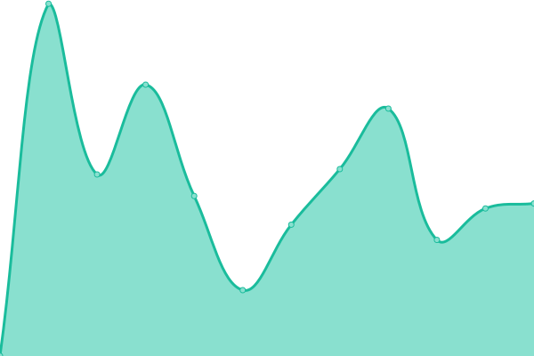

# [📈 Live Status](https://status.jae.fi): <!--live status--> **🟧 Partial outage**

This repository contains the open-source uptime monitor and status page for [Jae Lo Presti](https://jae.fi), powered by [Upptime](https://github.com/upptime/upptime).

With [Upptime](https://upptime.js.org), you can get your own unlimited and free uptime monitor and status page, powered entirely by a GitHub repository. We use [Issues](https://github.com/jae1911/status.jae.fi/issues) as incident reports, [Actions](https://github.com/jae1911/status.jae.fi/actions) as uptime monitors, and [Pages](https://status.jae.fi) for the status page.

<!--start: status pages-->
<!-- This summary is generated by Upptime (https://github.com/upptime/upptime) -->
<!-- Do not edit this manually, your changes will be overwritten -->
<!-- prettier-ignore -->
| URL | Status | History | Response Time | Uptime |
| --- | ------ | ------- | ------------- | ------ |
|  [Piped (Frontend)](https://yt.jae.fi) | 🟩 Up | [piped-frontend.yml](https://github.com/jae1911/status.jae.fi/commits/HEAD/history/piped-frontend.yml) | 

 461ms
     
 | 

<a href="https://status.jae.fi/history/piped-frontend">100.00%</a>
    

|  [Piped (API)](https://api.yt.jae.fi) | 🟥 Down | [piped-api.yml](https://github.com/jae1911/status.jae.fi/commits/HEAD/history/piped-api.yml) | 

 922ms
     
 | 

<a href="https://status.jae.fi/history/piped-api">92.30%</a>
    

|  [Piped (Proxy)](https://px.yt.jae.fi) | 🟩 Up | [piped-proxy.yml](https://github.com/jae1911/status.jae.fi/commits/HEAD/history/piped-proxy.yml) | 

 469ms
     
 | 

<a href="https://status.jae.fi/history/piped-proxy">100.00%</a>
    

|  [LibReddit](https://rd.jae.su) | 🟩 Up | [lib-reddit.yml](https://github.com/jae1911/status.jae.fi/commits/HEAD/history/lib-reddit.yml) | 

 2621ms
     
 | 

<a href="https://status.jae.fi/history/lib-reddit">98.63%</a>
    

|  [Nitter](https://twitter.jae.su) | 🟩 Up | [nitter.yml](https://github.com/jae1911/status.jae.fi/commits/HEAD/history/nitter.yml) | 

 1051ms
     
 | 

<a href="https://status.jae.fi/history/nitter">98.81%</a>
    

|  [PrivateBin](https://bin.jae.fi) | 🟩 Up | [private-bin.yml](https://github.com/jae1911/status.jae.fi/commits/HEAD/history/private-bin.yml) | 

 659ms
     
 | 

<a href="https://status.jae.fi/history/private-bin">100.00%</a>
    

|  [Reddit Account Search](https://reddit.jae.su) | 🟩 Up | [reddit-account-search.yml](https://github.com/jae1911/status.jae.fi/commits/HEAD/history/reddit-account-search.yml) | 

 2833ms
     
 | 

<a href="https://status.jae.fi/history/reddit-account-search">98.82%</a>
    

|  [KeyOxide](https://keys.jae.fi) | 🟩 Up | [key-oxide.yml](https://github.com/jae1911/status.jae.fi/commits/HEAD/history/key-oxide.yml) | 

 652ms
     
 | 

<a href="https://status.jae.fi/history/key-oxide">100.00%</a>
    

|  [ProxiTok](https://tok.jae.fi) | 🟩 Up | [proxi-tok.yml](https://github.com/jae1911/status.jae.fi/commits/HEAD/history/proxi-tok.yml) | 

 512ms
     
 | 

<a href="https://status.jae.fi/history/proxi-tok">100.00%</a>
    

|  [SearXNG](https://search.jae.fi) | 🟩 Up | [sear-xng.yml](https://github.com/jae1911/status.jae.fi/commits/HEAD/history/sear-xng.yml) | 

 965ms
     
 | 

<a href="https://status.jae.fi/history/sear-xng">100.00%</a>
    

|  [Wikiless](https://wiki.jae.fi) | 🟩 Up | [wikiless.yml](https://github.com/jae1911/status.jae.fi/commits/HEAD/history/wikiless.yml) | 

 961ms
     
 | 

<a href="https://status.jae.fi/history/wikiless">100.00%</a>
    

|  [Rimgo](https://imgur.jae.fi) | 🟩 Up | [rimgo.yml](https://github.com/jae1911/status.jae.fi/commits/HEAD/history/rimgo.yml) | 

 539ms
     
 | 

<a href="https://status.jae.fi/history/rimgo">100.00%</a>
    

|  [Excalidraw](https://draw.jae.fi) | 🟩 Up | [excalidraw.yml](https://github.com/jae1911/status.jae.fi/commits/HEAD/history/excalidraw.yml) | 

 554ms
     
 | 

<a href="https://status.jae.fi/history/excalidraw">100.00%</a>
    

|  [Hydrogen (Matrix client)](https://hydrogen.jae.fi) | 🟩 Up | [hydrogen-matrix-client.yml](https://github.com/jae1911/status.jae.fi/commits/HEAD/history/hydrogen-matrix-client.yml) | 

 701ms
     
 | 

<a href="https://status.jae.fi/history/hydrogen-matrix-client">100.00%</a>
    

|  [UwU Proxified](https://uwu.jae.fi) | 🟩 Up | [uw-u-proxified.yml](https://github.com/jae1911/status.jae.fi/commits/HEAD/history/uw-u-proxified.yml) | 

 629ms
     
 | 

<a href="https://status.jae.fi/history/uw-u-proxified">100.00%</a>
    

|  [LibreTranslate](https://translate.jae.fi) | 🟩 Up | [libre-translate.yml](https://github.com/jae1911/status.jae.fi/commits/HEAD/history/libre-translate.yml) | 

 1099ms
     
 | 

<a href="https://status.jae.fi/history/libre-translate">100.00%</a>
    

|  [NTFY](https://ntfy.jae.fi) | 🟩 Up | [ntfy.yml](https://github.com/jae1911/status.jae.fi/commits/HEAD/history/ntfy.yml) | 

 545ms
     
 | 

<a href="https://status.jae.fi/history/ntfy">100.00%</a>
    

|  [Invidious](https://invidious.jae.fi) | 🟩 Up | [invidious.yml](https://github.com/jae1911/status.jae.fi/commits/HEAD/history/invidious.yml) | 

 766ms
     
 | 

<a href="https://status.jae.fi/history/invidious">96.49%</a>
    

|  Main Router | 🟩 Up | [main-router.yml](https://github.com/jae1911/status.jae.fi/commits/HEAD/history/main-router.yml) | 

 131ms
     
 | 

<a href="https://status.jae.fi/history/main-router">100.00%</a>
    

<!--end: status pages-->

[**Visit our status website →**](https://status.jae.fi)

## 📄 License

- Powered by: [Upptime](https://github.com/upptime/upptime)
- Code: [MIT](./LICENSE) © [Jae Lo Presti](https://jae.fi)
- Data in the `./history` directory: [Open Database License](https://opendatacommons.org/licenses/odbl/1-0/)
